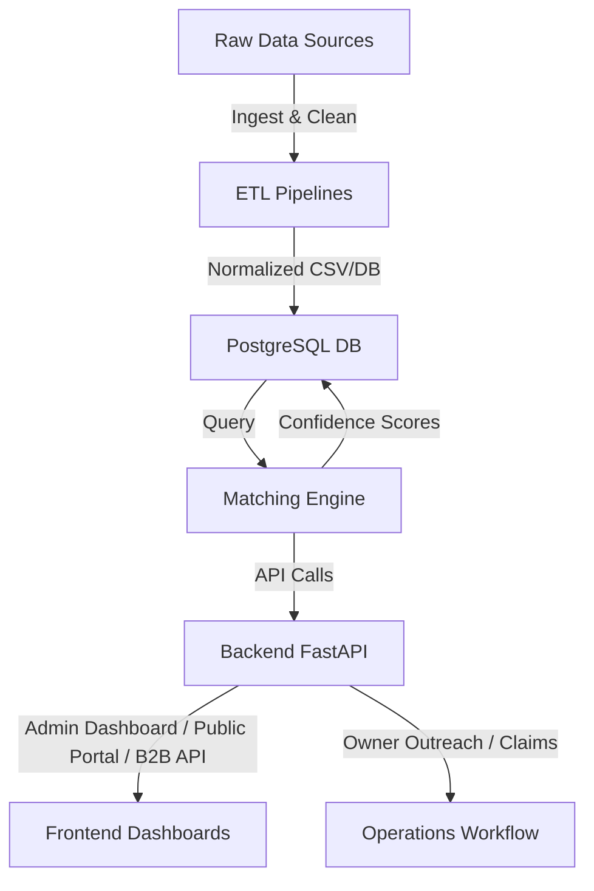

# Safiri Asset Intelligence

Safiri Asset Intelligence is a pan-African unclaimed asset recovery platform for governments, banks, insurers, and individuals. It leverages advanced matching algorithms, multi-channel outreach, and compliance automation to turn fragmented asset data into actionable recoveries.

---

## 🚀 Project Vision

- Recover billions in unclaimed assets across Africa
- Secure, compliant, scalable for institutions and individuals
- Build the largest African dormant asset dataset
- Become a $100M+ African data intelligence company

---

## 🏗️ Architecture Overview



---

## 🗂️ Repository Structure

```
safiri-asset-intelligence/
├── README.md
├── docker-compose.yml
├── .gitignore
├── requirements.txt
├── backend/
│   └── app/
│       ├── Dockerfile
│       ├── main.py
│       ├── integration_demo.py
│       ├── routes/
│       │   ├── claims.py
│       │   ├── b2b.py
│       │   └── public.py
│       ├── models/
│       │   └── asset_models.py
│       ├── matching_engine/
│       │   ├── __init__.py
│       │   └── fuzzy_match.py
│       ├── etl/
│       │   ├── uefa_ingest.py
│       │   ├── bank_ingest.py
│       │   └── insurer_ingest.py
│       └── utils/
│           └── data_cleaning.py
├── etl-pipelines/
│   ├── Dockerfile
│   ├── pipelines/
│   │   ├── uefa_ingest.py
│   │   ├── bank_ingest.py
│   │   └── insurer_ingest.py
│   └── utils.py
├── dashboards/
│   ├── admin_dashboard/
│   │   ├── Dockerfile
│   │   └── src/
│   │       └── App.js
│   ├── public_portal/
│   │   ├── Dockerfile
│   │   └── src/
│   │       └── App.js
│   └── institution_dashboard/
│       ├── Dockerfile
│       └── src/
│           └── App.js
├── db/
│   ├── init.sql
│   └── migrations/
└── docs/
    ├── architecture.md
    ├── setup_instructions.md
    └── api_documentation.md
```

---

## 💻 Quick Setup

1. Clone repo & build Docker environment:

   ```bash
   git clone <repo_url>
   cd safiri-asset-intelligence
   docker-compose up --build
   ```

2. Test integration_demo.py:

   ```bash
   docker-compose up integration_demo
   ```

3. Access services:
   - Backend API: http://localhost:8000
   - Admin Dashboard: http://localhost:3000
   - Public Portal: http://localhost:3001
   - Institution Dashboard: http://localhost:3002
   - PostgreSQL DB: localhost:5432

---

## 🔑 API Endpoints

- `/claims` — Admin dashboard endpoints
- `/b2b/matches` — B2B API for institutions
- `/public/search` — Public portal asset search

---

## ⚡ Dev Workflow

1. ETL pipelines ingest & normalize raw data
2. Data saved to PostgreSQL
3. Matching engine runs confidence scoring & duplicate check
4. Backend exposes FastAPI endpoints for dashboards & B2B API
5. Dashboards display results, submit claims, trigger outreach

---

## 📚 Contributing

- Fork the repository
- Create feature branches (`git checkout -b feature/XYZ`)
- Commit changes with clear messages
- Open pull requests for review

---

## 📞 Contact

Project Lead: [Your Name]
Email: your.email@example.com
Phone: +254-7XXXXXXXX

---

*Safiri Asset Intelligence — Unlocking Africa’s unclaimed wealth, one match at a time.*
